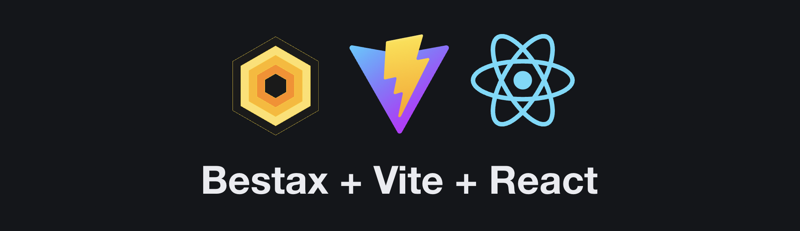
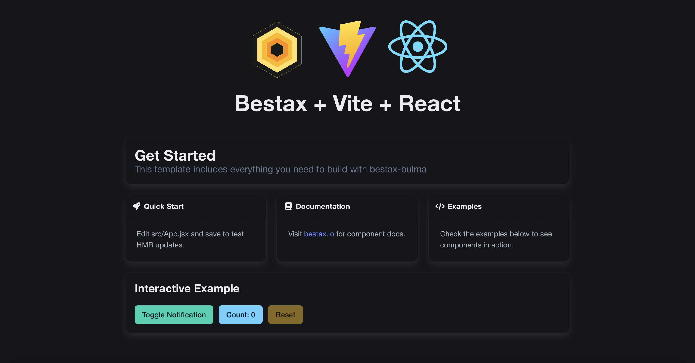
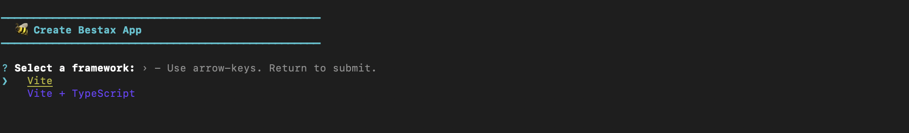
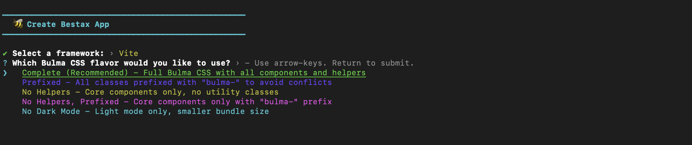
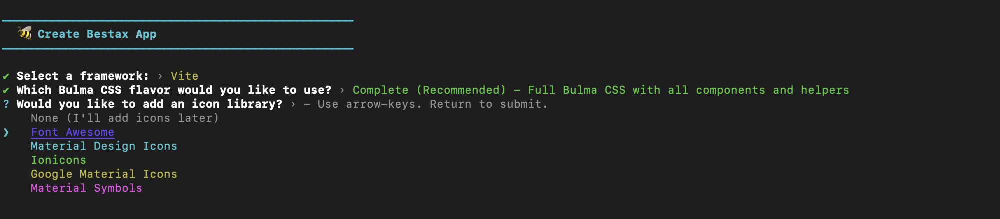
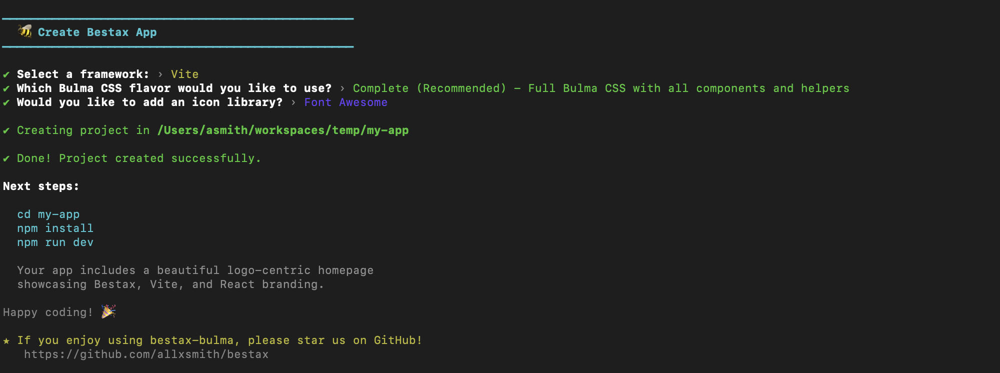

Want to build a React app with Bulma CSS in 2025? Forget the 10-step tutorials. Skip the configuration hell. Just run one command and start coding.

**One command. Under 30 seconds. You're building.**

<!-- truncate -->

## TL;DR - The Fastest Way

```bash
npm create bestax@latest my-app
```

### Wait, that's it?

Okay there is one other thing, you have to install your dependencies and start the dev server.

```bash
cd my-app
npm install
npm run dev
```


:::note
npm install
npm run dev

This is typical of any react vite project.
:::

That's it. You now have a production-ready React + Bulma application powered by Vite, with Javascript/TypeScript support, icon libraries, and the full power of [@allxsmith/bestax-bulma](https://bestax.io) at your fingertips.

Or, if you want even less interaction:

```bash
npm create bestax@latest my-app -y
```

The `-y` flag uses all the defaults and gets you up and running in literal seconds.

**Want your AI agent to do it for you?** Just tell Claude, ChatGPT, or your favorite coding assistant: "Use create-bestax to scaffold a new React + Bulma project" and watch it happen.

:::warning Good Job!

I've held your attention so far...If you enjoy reading and learning, or like my soap boxing, keep on reading.

**If create-bestax saved you time, please star ⭐⭐⭐ the repository**: [github.com/allxsmith/bestax](https://github.com/allxsmith/bestax)

:::

## The Death of create-react-app

Remember `create-react-app`? It was revolutionary when it launched. One command to bootstrap a React project with zero configuration. It democratized React development and became the de facto standard for years.

But in 2023, the React team deprecated it.

The ecosystem moved on. Webpack gave way to faster bundlers. The JavaScript landscape evolved. And developers were left asking: "So... what now?"

The answer isn't clear-cut anymore. You could use:

- Next.js (but that's for server-side rendering)
- Vite directly (but you need to configure the CSS and Icon framework yourself)
- Manual setup (do you really want to configure Babel, ESLint, and bundlers from scratch?)

**This is where create-bestax comes in.** It's the spiritual successor to create-react-app for developers who want React + a CSS framework, specifically Bulma, without the ceremony.

## Why React, Bulma, and Vite?

### React: The King of Frontend Frameworks

React remains the most popular frontend framework in 2025, and for good reason:

- **Massive ecosystem**: Libraries, tools, and solutions for every problem
- **Component-driven**: Build encapsulated, reusable UI pieces
- **Declarative**: Describe what you want, React handles the how
- **Industry standard**: More jobs, more tutorials, more community support
- **Battle-tested**: Used by Facebook, Netflix, Airbnb, and countless others

Whether you're building a simple dashboard or a complex application, React's flexibility and ecosystem make it the go-to choice.

### Bulma: The CSS Framework Renaissance

Bulma sits proudly as the third most popular CSS framework, behind Tailwind and Bootstrap. But here's the thing: Bulma v1 just changed the game.

The 2024 release of Bulma v1 brought:

- **CSS Grid support**: Modern layouts without fighting the framework
- **HSL theming**: Dynamic color customization with CSS variables
- **Skeleton components**: Built-in loading states
- **Dark mode**: First-class support out of the box
- **Prefix support**: Use Bulma alongside other frameworks without conflicts

This isn't your 2019 Bulma. This is a renaissance. Bulma is back, modernized, and ready for 2025.

Unlike Tailwind's utility-first approach (which some love, others find verbose), Bulma gives you semantic class names that are readable and maintainable. Unlike Bootstrap's JavaScript dependency, Bulma is pure CSS, giving you full control over behavior.

### Vite: The Bundler of Choice in 2025

If you're not using Vite in 2025, you're missing out. Period.

- **Lightning fast**: Cold starts in milliseconds, not seconds
- **Instant HMR**: See changes instantly during development
- **Optimized builds**: Production bundles that are lean and mean
- **Modern by default**: ES modules, code splitting, tree shaking
- **Zero config**: Works beautifully out of the box

Vite has become the de facto standard for modern web development, replacing Webpack for new projects. Every create-bestax project uses Vite, so you get that blazing-fast developer experience from day one.

## Introducing @allxsmith/bestax-bulma

At the heart of create-bestax is `@allxsmith/bestax-bulma`, a modern React component library built specifically for Bulma v1.

**Why it's special:**

- **99% test coverage**: Every component thoroughly tested
- **TypeScript-first**: Complete type safety and autocomplete
- **Feature-complete**: All Bulma components as React components
- **Global configuration**: Use `ConfigProvider` for prefixed classes
- **Dynamic theming**: Runtime theme switching with CSS variables
- **Comprehensive docs**: Full API documentation and guides at [bestax.io](https://bestax.io)
- **Active maintenance**: Regular updates and responsive support

Unlike older Bulma React libraries that are abandoned or haven't updated for v1, bestax-bulma is actively maintained and built for the modern Bulma ecosystem.

## The create-bestax Interactive Experience

When you run `npm create bestax@latest`, you get a friendly interactive CLI that asks you exactly what you want:

### 1. Project Name

```
? Project name: my-awesome-app
```

Simple. Straightforward. Uses validation to ensure your project name is npm-compatible.

### 2. Select Your Framework

```
? Select a framework:
  ❯ Vite
    Vite + TypeScript
```



Choose JavaScript or TypeScript. Both use Vite for that incredible developer experience.

### 3. Choose Your Bulma Flavor

```
? Which Bulma CSS flavor would you like to use?
  ❯ Complete (Recommended) - Full Bulma CSS with all components and helpers
    Prefixed - All classes prefixed with "bulma-" to avoid conflicts
    No Helpers - Core components only, no utility classes
    No Helpers, Prefixed - Core components only with "bulma-" prefix
    No Dark Mode - Light mode only, smaller bundle size
```



This is where create-bestax shines. Bulma v1 provides multiple CSS distributions, and create-bestax makes it trivial to choose the right one:

- **Complete**: The full Bulma experience (recommended for most projects)
- **Prefixed**: Need to use Bulma with Bootstrap or another framework? This prefixes all classes with `bulma-`
- **No Helpers**: Want a smaller bundle? Drop the utility classes
- **No Helpers, Prefixed**: Combination of the above
- **No Dark Mode**: If you only need light mode, save some bytes

### 4. Add an Icon Library

```
? Would you like to add an icon library?
  ❯ None (I'll add icons later)
    Font Awesome
    Material Design Icons
    Ionicons
    Google Material Icons
    Material Symbols
```



Icons are essential for modern UIs. create-bestax automatically installs and configures your chosen icon library. No more hunting through documentation to figure out how to import CSS files correctly.

## Command Line Options for Power Users

Don't want to answer questions? Use flags:

```bash
# Create a TypeScript project with Font Awesome
npm create bestax@latest my-app -t vite-ts -i fontawesome

# Use all defaults
npm create bestax@latest my-app -y

# Prefixed Bulma with Material Design Icons
npm create bestax@latest my-app -b prefixed -i mdi

# Full control
npm create bestax@latest my-app -t vite-ts -b complete -i fontawesome
```

**Available options:**

- `-t, --template <template>`: `vite` or `vite-ts`
- `-b, --bulma <flavor>`: `complete`, `prefixed`, `no-helpers`, `no-helpers-prefixed`, `no-dark-mode`
- `-i, --icon <library>`: `none`, `fontawesome`, `mdi`, `ionicons`, `material-icons`, `material-symbols`
- `-y, --yes`: Skip all prompts

## What You Get

After running create-bestax, you get a fully configured project with:

- **React** with Vite for blazing-fast development
- **Bulma CSS v1** in your chosen flavor
- **@allxsmith/bestax-bulma** component library pre-installed
- **Icon library** of your choice (optional)
- **Sample components** demonstrating bestax-bulma usage
- **Development scripts** ready to go
- **Production build** configuration
- **TypeScript** support (if you chose it)
- **Zero configuration** needed



Just run `npm install && npm run dev` and you're coding.


## From Zero to Running in Under 30 Seconds

Let's time it:

```bash
# Second 0-5: Scaffold the project
npm create bestax@latest my-demo-app -y

# Second 5-25: Install dependencies
cd my-demo-app
npm install

# Second 25-30: Start development server
npm run dev
```

**Under 30 seconds from command to running application.**

Compare that to:

1. Creating a Vite project manually
2. Installing React
3. Configuring React
4. Installing Bulma
5. Figuring out which Bulma CSS file to use
6. Installing bestax-bulma
7. Setting up icon libraries
8. Writing your first component

You just saved yourself 30 minutes to 2 hours of setup time.

## For the AI-Assisted Developers

In 2025, many of us use AI coding assistants. Claude Code, GitHub Copilot, ChatGPT, Cursor - they're all incredible tools.

Here's the beauty of create-bestax: **Your AI can use it too.**

Just tell your AI assistant:

> "Create a new React + Bulma project using create-bestax with TypeScript and Font Awesome icons"

And watch it execute:

```bash
npm create bestax@latest my-project -t vite-ts -i fontawesome -y
cd my-project
npm install
```

No ambiguity. No configuration decisions. Just working code.

## Get Started Today

Ready to build something amazing?

1. **Run the CLI**: `npm create bestax@latest my-app`
2. **Install dependencies**: `cd my-app && npm install`
3. **Start developing**: `npm run dev`
4. **Explore the docs**: [bestax.io](https://bestax.io)
5. **Star the repo**: [github.com/allxsmith/bestax](https://github.com/allxsmith/bestax)

## Support the Project

Listen, I'll be honest with you. It's alot of work maintaining this entire ecosystem: the component library, the CLI, the documentation, the examples. I survive on a strict diet of GitHub stars and Diet Coke.

**If create-bestax saved you time, please star the repository**: [github.com/allxsmith/bestax](https://github.com/allxsmith/bestax)

It helps more developers discover the project, and it keeps me caffeinated and motivated to keep improving it.

## What's Next?

This is just the beginning of your journey with React, Bulma, and bestax-bulma. Here's what to explore next:

- **Component Documentation**: Browse all available components at [bestax.io/docs/components](https://bestax.io/docs/components)
- **Theming Guide**: Learn how to customize your app's look with dynamic themes
- **API Reference**: Dive deep into component props and TypeScript types

---

**Have questions?** [Open an issue](https://github.com/allxsmith/bestax/issues) or [start a discussion](https://github.com/allxsmith/bestax/discussions) on GitHub.

**Want to contribute?** PRs are always welcome! Check out the [contributing guide](https://github.com/allxsmith/bestax/blob/main/CONTRIBUTING.md).

**View on npm**: [create-bestax on npm](https://www.npmjs.com/package/create-bestax)

Happy coding! Now stop reading and start building.
